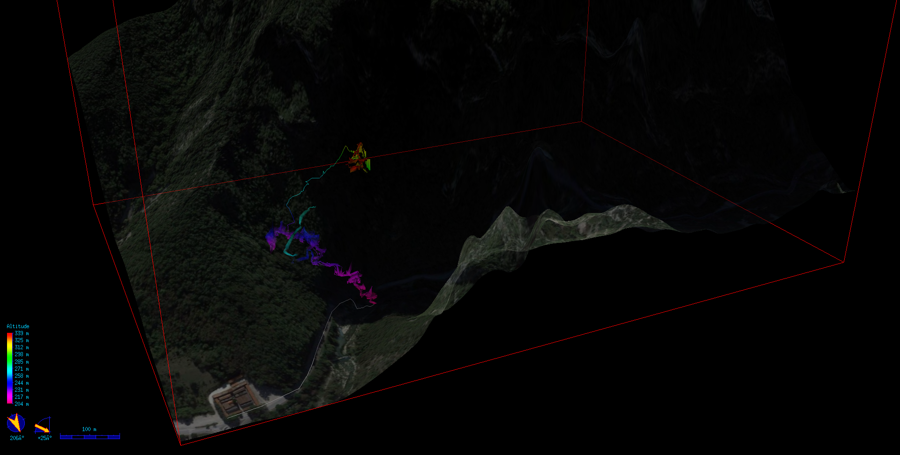

Grotta del Fiume survey
=======================

Requirements
------------

* Therion + Loch

To build STL model

* ParaView
* Meshlab

Build
-----

on Windows you can just double click on `build.bat`,

on other platforms

	mkdir out
	/path/to/therion GrottaDelFiume.thconfig
	/path/to/therion Ingresso.thconfig
	/path/to/therion RamoDellAria.thconfig

output files will be availabe in the `out` directory

Elevation Data
--------------

Elevation data has been built by the [Terrain Tool](http://www.ubss.org.uk/terraintool/terraintool.php) with theese settings

	Grid reference: 33T  334435.22 4806729.44
	E-W Range (m): 1100,00
	N-S Range (m): 800,00
	Spacing (m): 5,00
	Grid Ref is at: SW

	Coordinate System: UTM
	Datum: WGS-84
	Ellipsoid: GRS80

	Terion cs name: UTM33

Due to missing/wrong elevation data in the gorge zone, the generated therion file has been patched replacing values `-32768.00` with `200`
